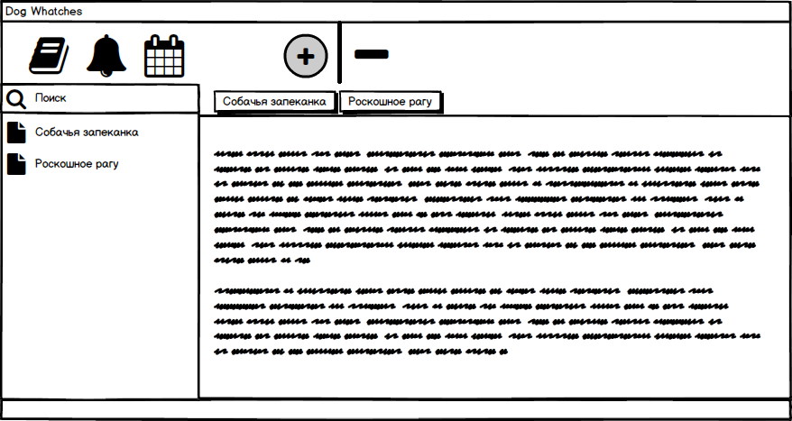
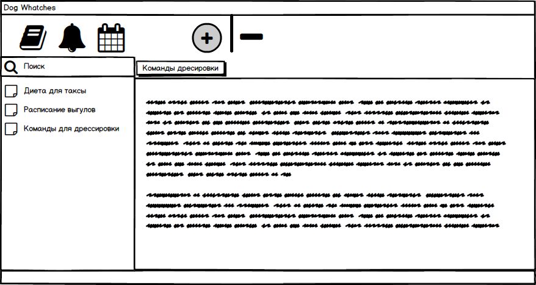

# Требования к проекту
---

# Содержание
1 [Введение](#start) 
1.1 [Назначение](#appointment) 
1.2 [Бизнес-требования](#bisuness_requirenments) 
1.2.1 [Исходные данные](#first_info) 
1.2.2 [Возможности бизнеса](#bisuness_opportunities) 
1.2.3 [Границы проекта](#project_line) 
2 [Требования пользователя](#user_requirenments) 
2.1 [Программные интерфейсы](#program_interfaces) 
2.2 [Интерфейсы пользователя](#user_interfaces) 
2.3 [Характеритстики пользователя](#user_characteristics) 
3 [Системные требования](#system_requirenments) 
3.1 [Функциональные требования](#functional_requirenments) 
3.1.1 [Основные функции](#main_functions) 
3.1.1.1 [Вход неактивного пользователя в приложение](#user_visit) 
3.1.1.2 [Настройка профиля активного пользователя](#user_sign_in) 
3.1.1.3 [Добавление нового ингредиента](#create_item) 
3.1.1.4 [Составление нового рецепта](#create_recipe) 
3.2 [Нефункциональные требования](#nonfunctional_requirenments) 
3.2.1 [Атрибуты качества](#quality) 
3.2.1.1 [Требования к удобству использования](#use_requirements) 
3.2.1.2 [Требования к безопасности](#security_requirements) 
3.2.2 [Внешние интерфейсы](#outside_interfaces) 

<a name ="start"><a/>

# 1 Введение

<a name ="appointment"><a/>

## 1.1 Назначение

В этом документе описаны функциональные и нефункциональные требования к Dekstop приложению «Dog Wathces».

<a name ="bisuness_requirenments"><a/>

## 1.2 Бизнес-требования

<a name ="first_info"><a/>
          
### 1.2.1 Исходные данные

Мы в ответственности за тех, кого приручили. Именно по этому за многими уникальными и редкими породами нужен особый уход. Многие особенности индивидуальной диеты и тренировок теряются в бесконечных закладках в журналах для собачников и именно по этому было разработано это приложение.

<a name ="bisuness_opportunities"><a/>
  
### 1.2.2 Возможности бизнеса

Записывать рецепты, записывать тренировки, делать заметки разного рода. Для удобства реализован таймер, чтобы вы не забыли выйти на выгул вовремя.

<a name ="project_line"><a/>
  
### 1.2.3 Границы проекта

Данное приложение позволяет создавать необходимые рецепты,сохраняемых в базе данных, делать заметки. Реализован поиск по названию рецепта или заметки. Создание заметки сопровождается выбором даты и времени.

<a name ="user-requirenments"><a/>

# 2 Требования пользователя

<a name ="program_interfaces"><a/>
          
## 2.1 Программные интерфейсы

Приложение разрабатывается на платформе Java под операционные системы Windows и Linux.

<a name ="user_interfaces"><a/>
          
## 2.2 Интерфейсы пользователя

Окно для просмотра сохраненных рецептов.

 

Окно для просмотра и добавления новых заметок.

 

<a name ="user_characteristics"><a/>

## 2.3 Характеристики пользователя

Данное приложение расчитанно на взрослых людей и подростков, интересующихся в заьоте о своём питомце.

<a name ="system_requirenments"><a/>
          
# 3 Системные требования

<a name ="functional_requirenments"><a/>
          
## 3.1 Функциональные требования

<a name ="main_functions"><a/>
          
### 3.1.1 Основные функции

<a name ="user_visit"><a/>
          
#### 3.1.1.1 Вход неактивного пользователя в приложение

**Описание.** Пользователь впервые вошедший в приложение может использовать его для просмотра имеющихся в базе данных рецептов.

| Функция | Требования | 
|:---|:---|
| Вход в приложение без создание собственного профиля | Пользователь может просмотреть список рецептов, но редактирование до активации не допускается |

<a name ="user_sign_in"><a/>
 
#### 3.1.1.2 Настройка профиля активного пользователя

**Описание.** Настройка профиля приведет к возможности успешного редактирования и удаления имеющихся рецептов, вносить изменения в заметки.

| Функция | Требования | 
|:---|:---|
| Добавление рецепта | Приложение требует ввода пользователем необходимых для рецепта параметров. |
| Редактирование рецепта | Изменение определенных параметров в уже созданном рецепте. |
| Добавление заметки | Необходимо ввести параметры для заметки. |
| Редактирование заметки | Изменение определенных параметров в уже созданной заметке. |

<a name ="create_item"><a/>
          
#### 3.2.1.3 Добавление новой заметки
**Описание.** Пользователь имеет возможность добавить новую заметку.

**Требование.** Приложение должно предоставить пользователю возможность добавления новой заметки для разного рода вещей. 
<a name ="create_recipe"><a/>
          
#### 3.2.1.4 Добавление нового рецепта
**Описание.** Пользователь имеет возможность добавить новый рецепт в общий список.

**Требование.** Приложение должно предоставить пользователю возможность создания новой рецепта. Требуется ввод название блюда, указать список необходимых ингредиентов, их количества, а также пощаговой интсрукции для выполнения во время приготовления. По желанию возможно добавления пометок. 
          

<a name ="nonfunctional_requirenments"><a/>
          
## 3.2 Нефункциональные требования

<a name ="quality"><a/>
          
### 3.2.1 Атрибуты качетсва   

<a name ="use_requirements"><a/>
          
#### 3.2.1.1 Требования к удобству использования

* Все функциональные элементы пользовательского интерфейса имеют названия, описывающие действие, которое произойдет при выборе cсоотвествующего элемента;
* Удобное расположение элементов графического интерфейса способствует быстрому ориентированию в приложении;
* Пошаговая инструкция использования основных функций приложения отображена в справке.

<a name ="security_requirements"><a/>
          
#### 3.2.1.2 Требования к безопасности

Редактирование и добавление заметок рецептов осуществляется только после активации профиля пользователя.         

<a name ="outside_interfaces"><a/>
          
### 3.2.2 Внешние интерфейсы

Окна приложения удобны для использования пользователями с плохим зрением:
  * размер шрифта удобен для восприятия;
  * функциональные элементы контрастны фону окна;
  * отсутствие ярких изображений не отвлекает внимание во время приготовления.

